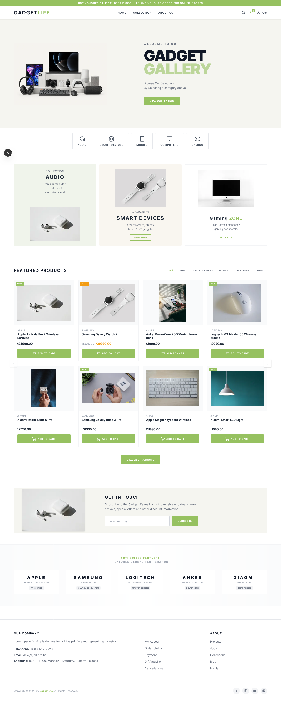
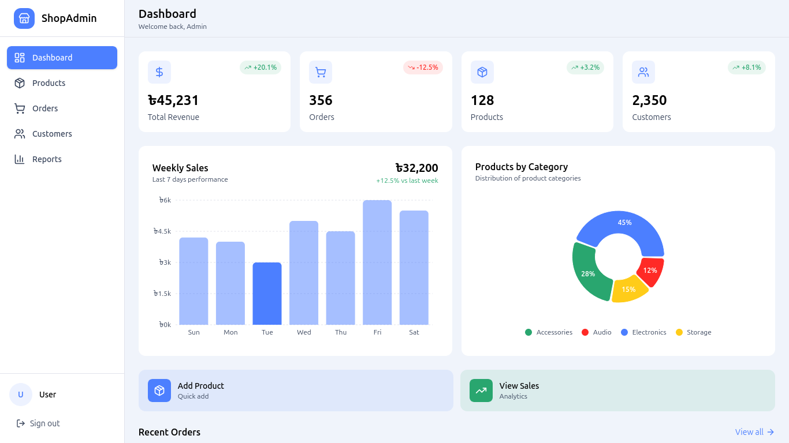
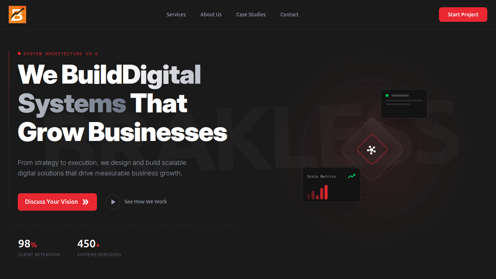
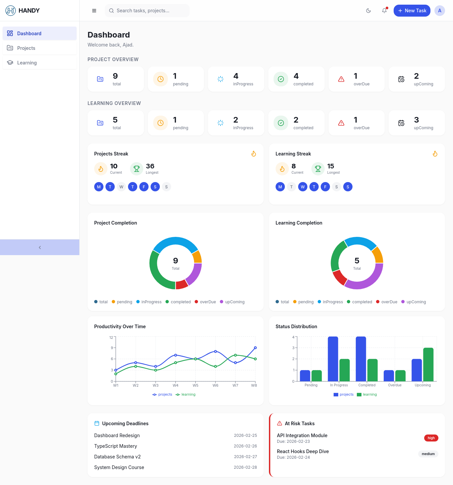
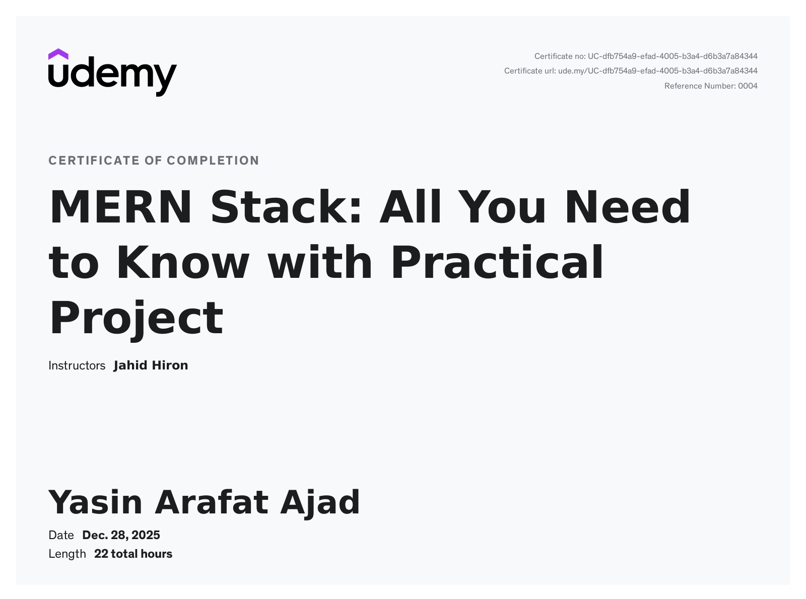
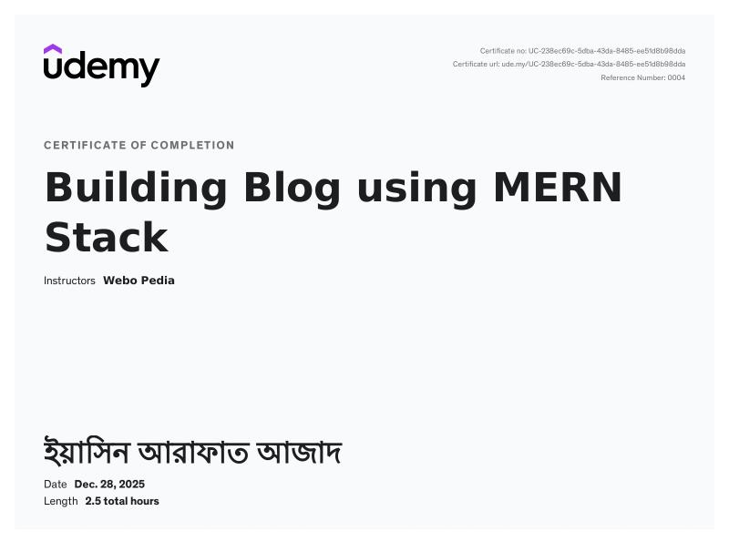

<!-- Profile Views -->

  

<!-- Name & Title -->
<h1 align="center">Yasin Arafat Ajad</h1>
<h3 align="center">
Full-Stack Web Developer (MERN) · Started Journey in 2022 · Linux, Deployment & Diagnosis Expert
</h3>

<!-- GitHub Streak -->

  

<!--
## Competitive Programming

 - LeetCode Profile :  https://leetcode.com/u/yasinarafatajad/

I am a **Full-Stack Web Developer** specializing in the **MERN stack**, with **4+ years of professional experience (2022–Present)**. I build **scalable, maintainable, and production-ready web applications** with **secure authentication, modular architecture, performance optimization, and marketing integrations**.  
-->
## Professional Summary

I have successfully delivered:  
- Business and portfolio websites  
- E-commerce platforms with analytics and conversion tracking  
- Admin dashboards and analytics panels  
- REST API–driven systems  
- Real-time and role-based applications  

I prioritize **code quality, deployment readiness, measurable performance, and long-term maintainability**.

---

## Technical Skills

**Frontend:** React, Next.js, JavaScript (ES6+), HTML5, CSS3, Tailwind CSS, Framer Motion  , others ui library[ShadCN UI,daisy ui etc]
**Backend:** Node.js, Express.js, MongoDB, REST APIs, JWT Authentication  
**DevOps & Deployment:** Linux (Ubuntu), VPS, cPanel, Domain setup, Vercel, Render, CI/CD Automation 
**Marketing & Analytics:** Facebook Pixel, Google Tag Manager, Google Analytics, Conversion API, Google Search Console  
**Tools & IDEs:** Git, GitHub, Postman, Compass Figma, VSCode, Antigravity, Claude Code,  
**Architecture & Practices:** Clean, modular code, role-based access, secure authentication, scalable systems  

---

## Experience Timeline

**2022 – Present**  
- Built and maintained **5+ production-ready MERN applications**, covering frontend, backend, and deployment.  
- Developed **admin dashboards and analytics panels** handling **10k+ users** with scalable APIs.  
- Reduced API response time by **30%** through optimized database queries and caching.  
- Handled **Linux servers, VPS deployments, domain setup, and cPanel configurations**.  
- Implemented **Facebook Pixel, Google Tag Manager, Google Analytics, and Conversion API** for tracking sales and marketing performance.  
- Indexed websites using **Google Search Console** to improve SEO and SERP visibility.  
- Contributed to personal and open-source projects with **clean, modular architecture**.  

---

## Projects & Demos

| Project | Description | Tech Stack | Demo / Screenshot |
|---------|-------------|-----------|-----------------|
| **E-Commerce Platform** | Multi-vendor store with role-based access, payment gateway integration, real-time inventory updates, and analytics tracking. | Next.js, Node.js, Express, MongoDB, Tailwind CSS, Daisy ui, Facebook Pixel |  |
| **Admin Dashboard** | Analytics dashboard with charts, user management, live notifications, and conversion tracking. | Next.js, Node.js, Firebase, Framer Motion, GA |  |
| **Portfolio Website** | Personal portfolio with projects showcase, contact form, responsive design, and analytics setup. | React, Tailwind CSS, ShadCN UI, GA |  |
| **Project Management** | HANDY is a full-stack project and learning management application designed to streamline personal productivity through structured project tracking, progress analytics, and streak-based motivation. | React.js, TypeScript, Tailwind CSS, Express, Node.js, Mongo DB |  |
> All projects are **fully deployed**, **tracked with analytics**, and accessible via my portfolio: [Visit Portfolio](https://yasinarafatajad.vercel.app)

---

## Udemy Certifications

| Tech Stack | Certifications |
|----------------------|----------------------------|
| **MERN Stack : Full Stack** |  |
| **Blog : Full Stack** |  |

---

## GitHub Activity

### Contribution Graph

  

---

## GitHub Achievements

  

---

## Tech Stack Overview

  

---

## Connect & Portfolio

  
  
  
  
  

  <a href="https://yasinarafatajad.vercel.app" target="_blank">
    <strong>Visit My Portfolio</strong>
  </a>

